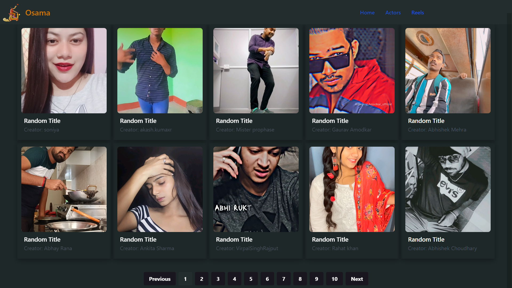
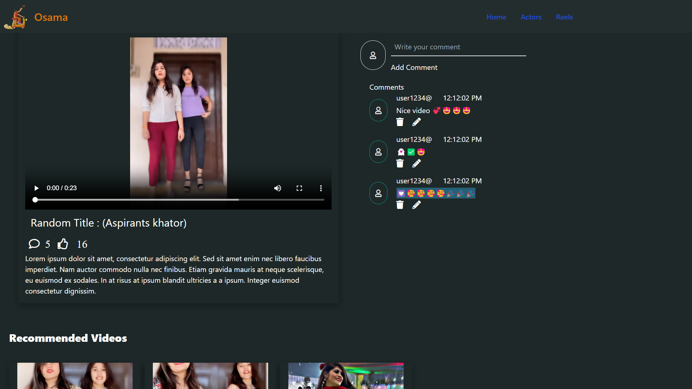
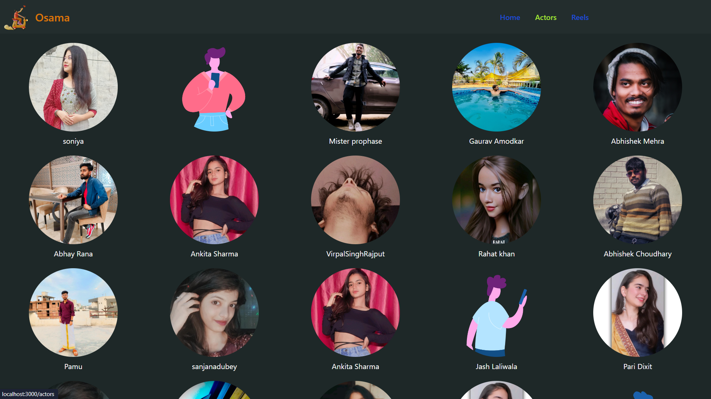
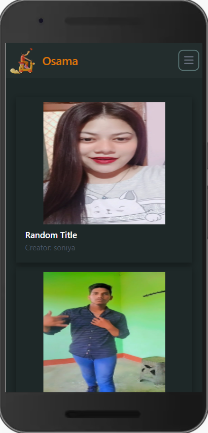
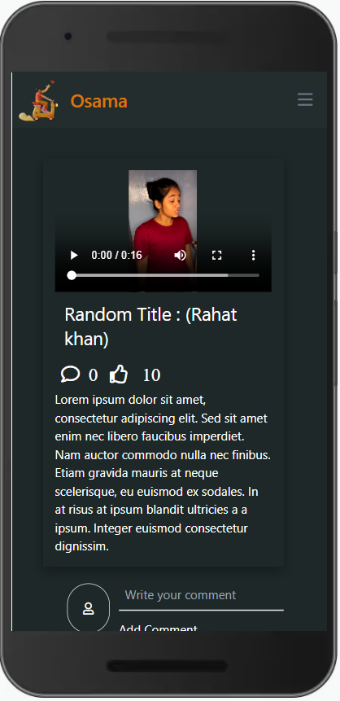
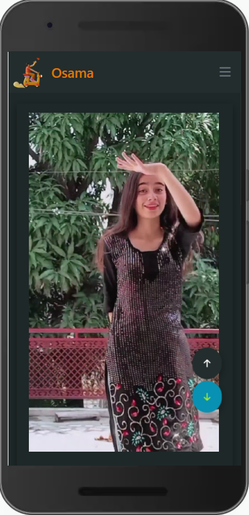

# Video_Clone Web Application

Welcome to the Video_Clone Web Application! This web application allows you to browse and watch a collection of video. Explore various video, enjoy watching reels, and more!

## Table of Contents

- [About](#about)
- [Features](#features)
- [Getting Started](#getting-started)
- [Usage](#usage)
- [Technologies Used](#technologies-used)
- [Deployment](#deployment)
- [Contributing](#contributing)
- [License](#license)

## About

Video_Clone Web Application! is a web application designed to help users easily access video,reels,and creator
## Features

- Browse a collection of video.
- Add comments to share your thoughts on videos.
- Watch videos on the basis of recommendation.
- Filter video by creator.
- Enjoy a seamless infinite scroll reel-watching experience.

## Screenshots

## Deployment

Deployed Link:-https://hypergro-assignment.vercel.app

## Getting Started

# Clone the repository

git clone https://github.com/Abu1Osama/Hypergro_Assignment.git

# Change directory

cd your-repo

# Install dependencies

npm install

# Start the development server

npm start

## Technologies Used

- Video_Clone Web Application is built using the following technologies:

- React.js
- Tailwind CSS
- Axios
- JavaScript

## Usage

- Visit the application in your web browser at http://localhost:3000 or the URL https://hypergro-assignment.vercel.app .
1. Browse a collection of video.
2. Add comments to share your thoughts on videos.
3. Watch videos on the basis of recommendation.
4. Filter video by creator.
5. Enjoy a seamless infinite scroll reel-watching experience.